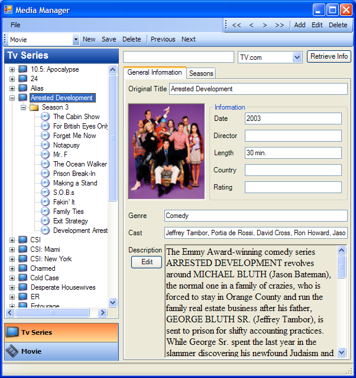
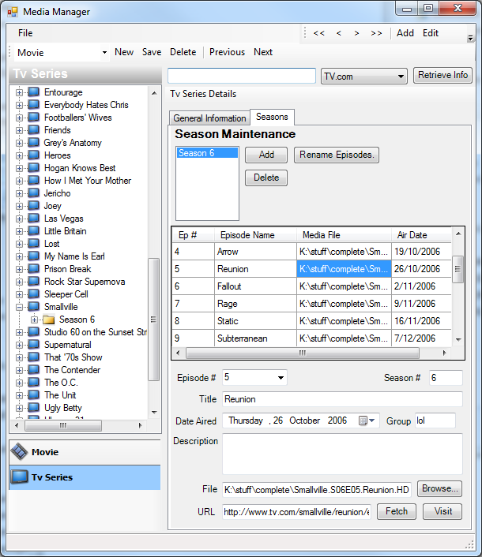
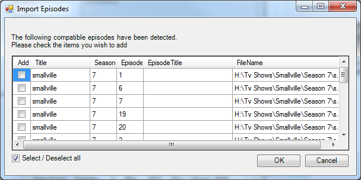
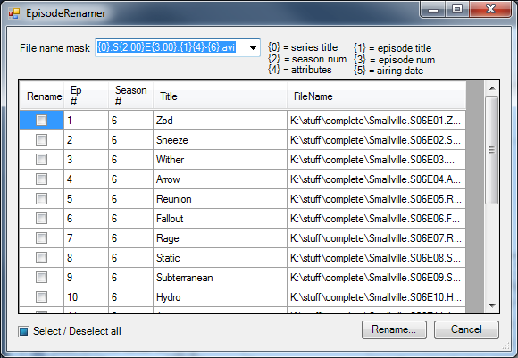

MediaManager
============

MediaManager is an application that allows users to manage their media (tv shows/movies). 
MM has a concept of 'App Helpers'. App Helpers are plugins that are able to retrieve metadata 
for certain types of media. There are currently app helpers for IMDB, Amazon, Tv.Com and others.

Movies
------
MediaManager allows you to keep a catalog of your movies whether they be media files or physical media.

Tv Shows
--------
Tv Shows may consist of multiple seasons and episodes. MM allows you to retrieve metadata for 
particular shows/seasons through a corresponding app helper.

Tv Episode files can be dropped onto the Season Maintenance form. This will attempt to identify the Tv Show and season/episode numbers.

Once episodes have been imported and associated with their corresponding metadata, the MM app will
allow users to rename episodes. This is useful because it allows the episode files to be named 
consistently and optionally include the episode title and other information in the filename.

For example, Smallville-106.avi could be renamed to Smallville.S01E06.Hourglass.avi

